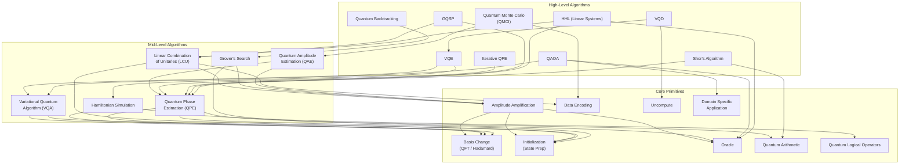
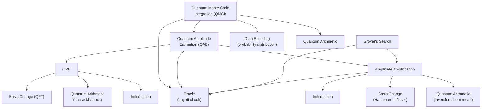
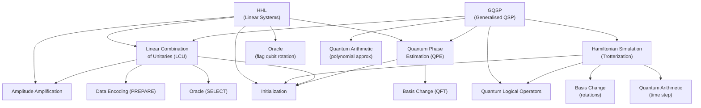
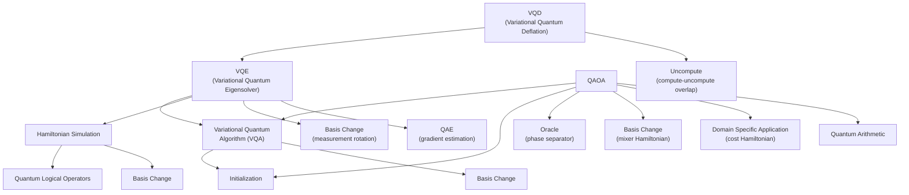
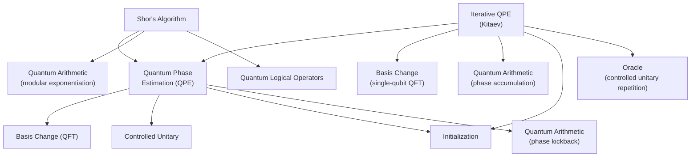
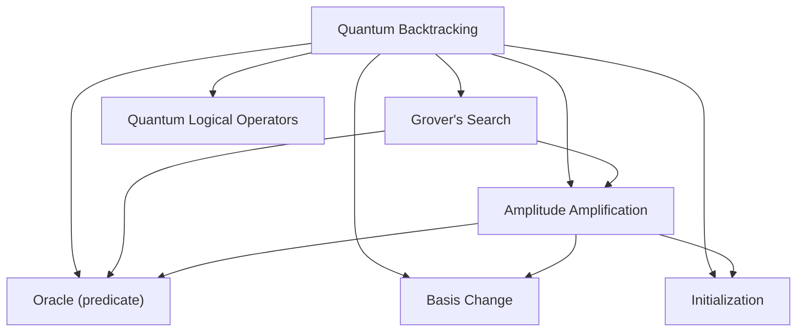

# Quantum Algorithm Composition Hierarchies

How high-level quantum algorithms decompose into lower-level building blocks.

---

## 1. Core Primitives Dependency Overview

A single view showing which algorithms depend on which building blocks.

---

## 2. Amplitude-Based Algorithm Family

---

## 3. Linear Systems & Simulation Family

---

## 4. Variational Algorithm Family

---

## 5. Phase Estimation Family

---

## 6. Quantum Backtracking

