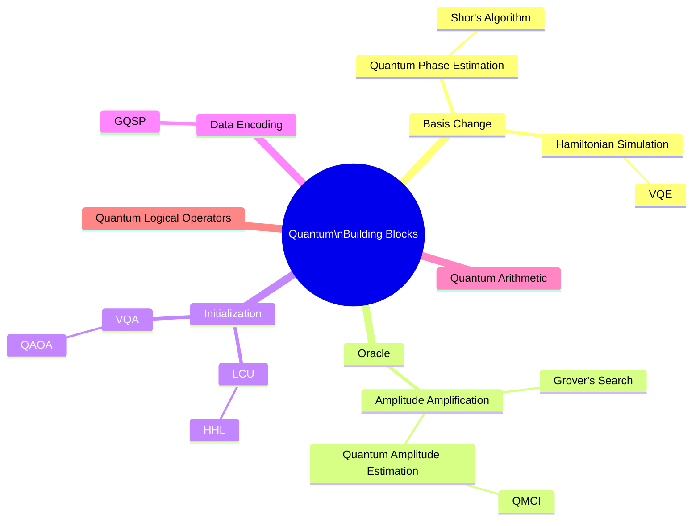

# Quantum Core Primitives — Dependency Mindmap

Each algorithm appears once, under its primary primitive dependency.
Indentation means "is primarily built on".

> **20 nodes:** root + Basis Change, QPE, Shor's, Hamiltonian Simulation, VQE, Oracle, Amplitude Amplification, Grover's Search, QAE, QMCI, Initialization, LCU, HHL, VQA, QAOA, Data Encoding, GQSP, Quantum Arithmetic, Quantum Logical Operators.
